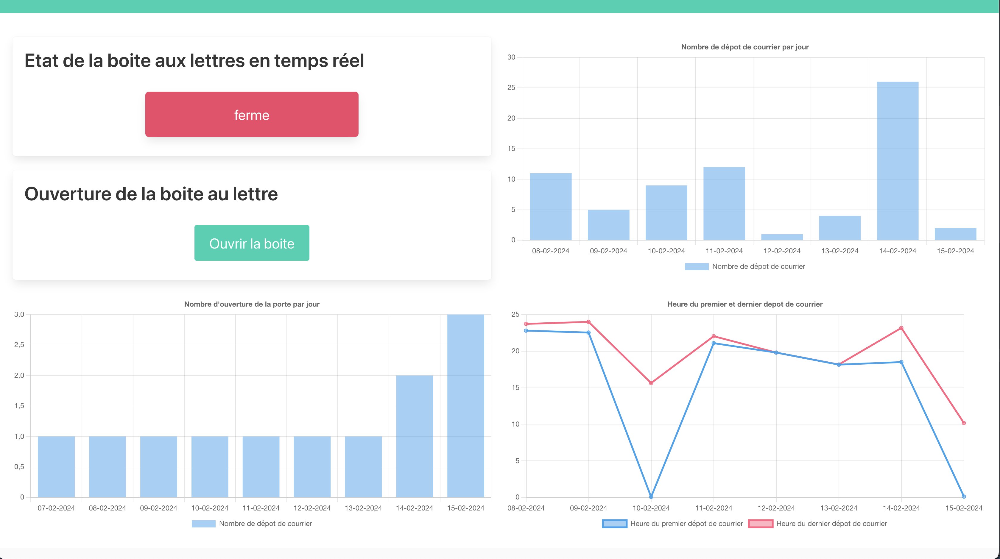
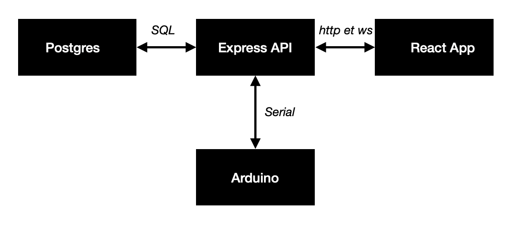
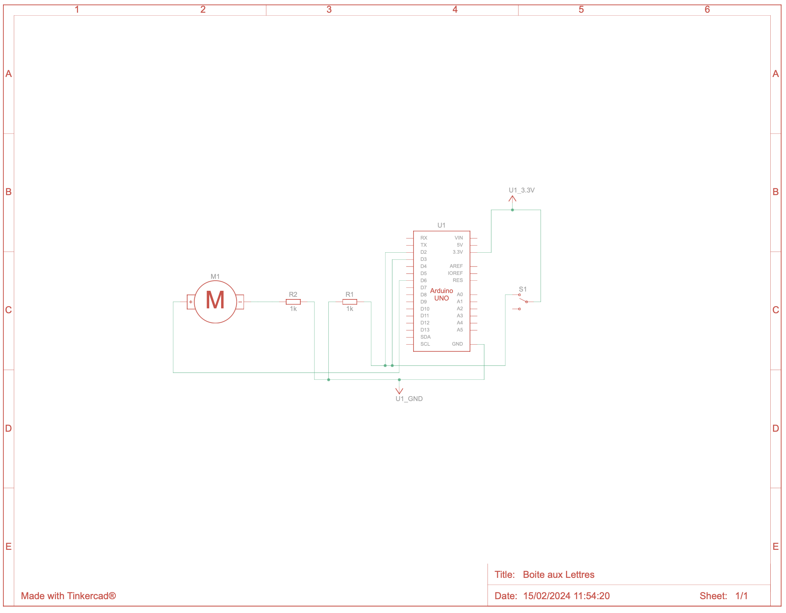
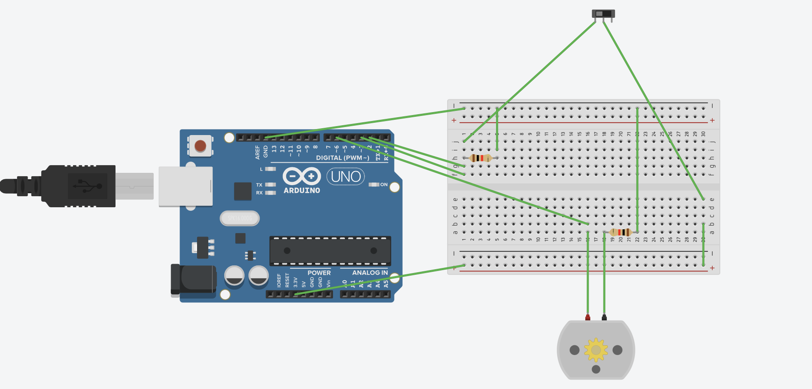

# Boite aux Lettres

## Installation

1. Clonner le repo git via la commande

```
git clone https://github.com/ColinPallier/boiteLettre.git
cd boiteLettre
```

2. Téléverser le fichier _./arduino/boite.ino_ dans votre carte arduino

3. Utiliser les commandes suivante après avoir modifié les fichiers .env.back.example et .env.front.example

```:
cp .env.back.example .env
cp .env.front.example ./client/.env
```

4. Utiliser la commande suivante afin de créer le conteneur docker contenant la base PG et le front de l'application

```
docker-compose up -d
```

5. Pour des raisons de compatibilité je n'ai pas pu dockerizer l'API il faut donc le lancer via la commande suivante

```
cd ./serveur &&  npm start
```

## Présentation de l'application

L'application est composé de 4 modules (de haut en bas et de droite a gauche) :

- Le premier module affiche l'état de le boite aux lettre en temps réel ainsi que le bouton permettant l'ouverture de la boite
- Le second est un graphique reprensentant le nombre d'ouverture de la fante de la boite au lettre par jour
- Le troisième est un graphique qui repérsente le nombre de fois que l'ouverture électronique a été demandé par l'utilisateur
- Enfin le dernier graphique represente la première heure d'ouverture de la boite ainsi que la dernière ouverture par jour



## Technique

Ci dessous un schéma de l'architecture du projet



Ci dessous les différents schéma de montage élétronique arduino




